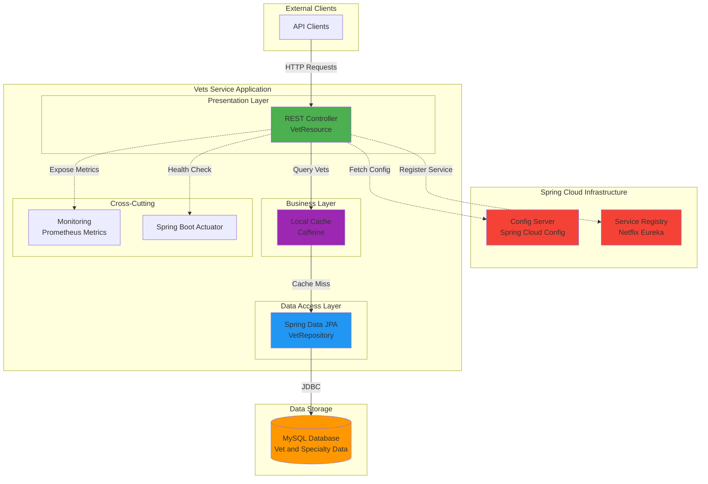

# Architecture Diagram - Spring PetClinic Vets Service

This diagram illustrates the current architecture of the Vets Service microservice.

## Current Architecture

## Architecture Components

### Application Layers

1. **Presentation Layer**
   - REST API endpoints for veterinarian data
   - Exposes GET /vets endpoint
   - Built with Spring Web MVC

2. **Business Layer**
   - Caching logic using Caffeine
   - Local in-memory cache for vet data
   - Improves response time for frequent queries

3. **Data Access Layer**
   - Spring Data JPA repositories
   - Entity mapping for Vet and Specialty
   - Database abstraction layer

4. **Cross-Cutting Concerns**
   - Health monitoring via Spring Boot Actuator
   - Metrics collection with Prometheus
   - Centralized logging support

### Technology Stack

- **Framework**: Spring Boot 3.4.1
- **Cloud Stack**: Spring Cloud 2024.0.0
- **Java Version**: JDK 17
- **Build Tool**: Maven
- **Database**: MySQL with Azure MySQL JDBC driver
- **Cache**: Caffeine (in-memory)
- **Service Discovery**: Netflix Eureka Client
- **Configuration**: Spring Cloud Config Client
- **Monitoring**: Micrometer with Prometheus

### External Dependencies

1. **Config Server** (Spring Cloud Config)
   - Provides centralized configuration management
   - Fetches application properties at startup

2. **Service Registry** (Netflix Eureka)
   - Service registration and discovery
   - Enables other microservices to locate this service

3. **MySQL Database**
   - Stores veterinarian and specialty information
   - Supports both HSQLDB (dev) and MySQL (prod)

4. **Prometheus**
   - Metrics collection and monitoring
   - Exposes /actuator/prometheus endpoint

## Data Flow

1. Client sends HTTP request to REST API
2. REST Controller checks local Caffeine cache
3. On cache miss, queries database via JPA
4. Data retrieved from MySQL database
5. Response cached and returned to client
6. Service registers with Eureka for discovery
7. Configuration loaded from Config Server
8. Metrics exposed for Prometheus scraping

## Azure Migration Considerations

Based on the assessment, key migration considerations include:

- **Config Server → Azure App Configuration**: Migrate centralized configuration
- **Eureka → Azure Service Registry**: Use Azure Spring Apps built-in service discovery
- **Caffeine Cache → Azure Cache for Redis**: Enable distributed caching across instances
- **MySQL → Azure MySQL Flexible Server**: Migrate to managed database service
- **Prometheus → Azure Monitor**: Integrate with Azure Monitor and Application Insights

For detailed migration guidance, refer to the assessment summary and modernization plan.
