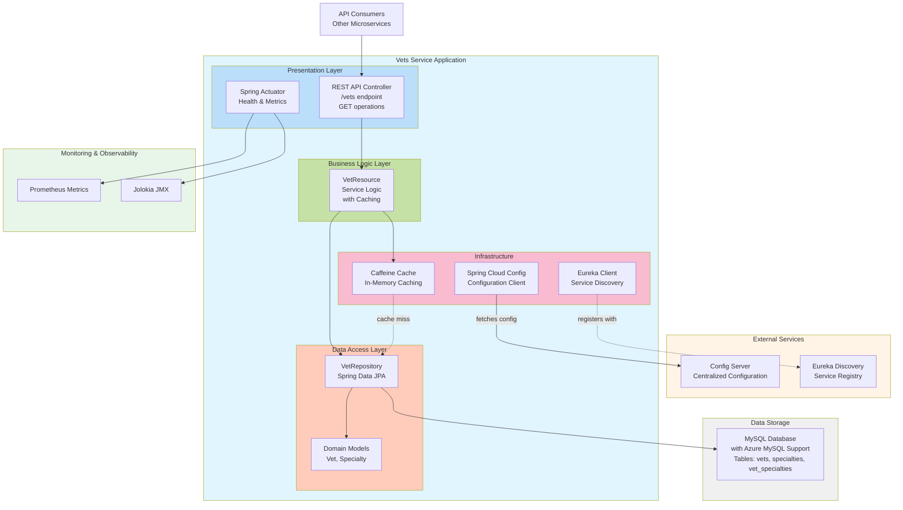

# Vets Service - Architecture Diagram

## Application Overview

This diagram represents the architecture of the Spring PetClinic Vets Service microservice, which manages veterinarian information including their specialties.

## Architecture Diagram

## Technology Stack

### Framework & Runtime
- **Spring Boot**: 3.4.1
- **Java Version**: 17
- **Build Tool**: Maven

### Core Dependencies
- **Spring Web**: REST API support
- **Spring Data JPA**: Database access and ORM
- **Spring Cloud Config**: External configuration management
- **Spring Cloud Netflix Eureka**: Service discovery and registration
- **Spring Boot Actuator**: Health checks and monitoring endpoints

### Data & Caching
- **MySQL Connector**: Database driver
- **Azure Spring Cloud JDBC**: Azure MySQL integration
- **Caffeine Cache**: High-performance in-memory caching
- **HSQLDB**: In-memory database for testing

### Monitoring & Observability
- **Micrometer Prometheus**: Metrics collection
- **Jolokia**: JMX over HTTP
- **Chaos Monkey**: Resiliency testing (optional)

### Development Tools
- **Lombok**: Boilerplate code reduction
- **JUnit Jupiter**: Unit testing framework

## Application Layers

### 1. Presentation Layer
- **VetResource**: REST controller exposing `/vets` endpoint
- **Spring Actuator**: Health check and metrics endpoints
- Handles HTTP requests and returns JSON responses

### 2. Business Logic Layer
- **VetResource Service**: Orchestrates business logic with caching
- Implements caching strategy using `@Cacheable` annotation
- Delegates to repository for data access

### 3. Data Access Layer
- **VetRepository**: Spring Data JPA repository interface
- **Domain Models**: Vet and Specialty entities with JPA annotations
- Manages database interactions and entity relationships

### 4. Infrastructure Layer
- **Cache Configuration**: Caffeine-based caching (production profile)
- **Service Discovery**: Eureka client for service registration
- **Configuration Management**: Spring Cloud Config client

## Data Flow

1. **Service Initialization**:
   - Connects to Config Server for configuration
   - Registers with Eureka Discovery Server
   - Initializes database connections

2. **API Request Flow**:
   - Client sends GET request to `/vets`
   - REST Controller receives request
   - Business logic checks cache
   - If cache miss, queries database via JPA repository
   - Returns list of veterinarians with specialties
   - Result is cached for subsequent requests

3. **Data Storage**:
   - MySQL database stores vet and specialty information
   - Many-to-many relationship between vets and specialties
   - Azure MySQL support via Spring Cloud Azure

## External Dependencies

- **Config Server**: Centralized configuration management
- **Eureka Server**: Service registry for microservices discovery
- **MySQL Database**: Persistent data storage

## Key Features

- **RESTful API**: Simple GET endpoint for retrieving veterinarians
- **Caching**: Performance optimization with Caffeine cache
- **Service Discovery**: Automatic registration with Eureka
- **Cloud-Ready**: Azure Spring Cloud integration for MySQL
- **Monitoring**: Prometheus metrics and Actuator endpoints
- **JPA/Hibernate**: ORM for database access

## Migration Considerations

Based on the assessment report, the following items should be considered for Azure migration:

1. **Service Discovery**: Replace Eureka with Azure-native service discovery
2. **Configuration Management**: Consider Azure App Configuration instead of Config Server
3. **Database**: Use Azure Database for MySQL with managed identity
4. **Monitoring**: Integrate with Azure Monitor and Application Insights

## Notes

- Application runs on port 8081 (configurable)
- Production profile enables caching
- Docker support available via Maven profile
- Uses Spring Cloud 2024.0.0 and Azure Spring Cloud 5.20.1
