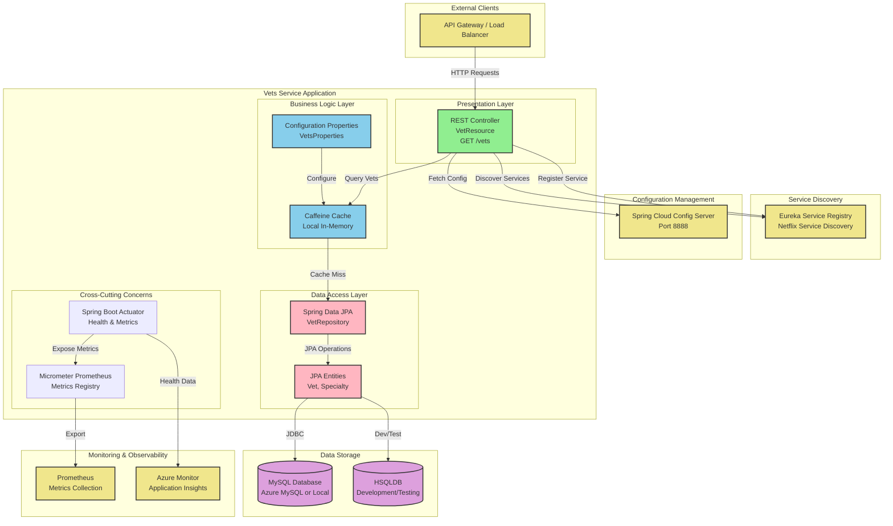
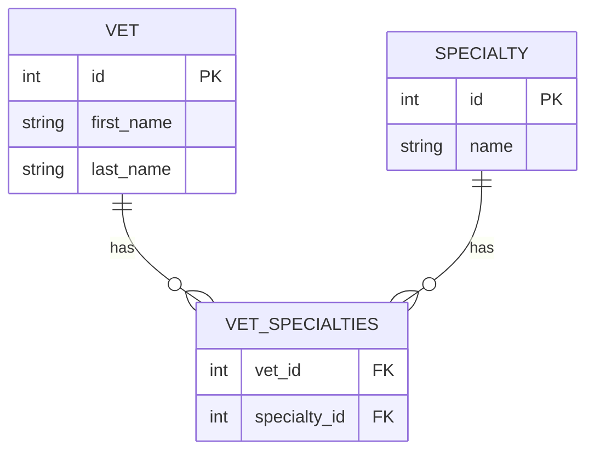

# Architecture Diagram: Spring PetClinic Vets Service

## Overview
This diagram shows the high-level architecture of the Vets Service microservice, part of the Spring PetClinic application.

## Architecture Diagram

## Technology Stack

### Application Framework
- **Spring Boot**: 3.4.1
- **Java Version**: 17
- **Build Tool**: Maven

### Spring Components
- **Spring Web**: REST API endpoints
- **Spring Data JPA**: Data access layer
- **Spring Cloud Config**: Externalized configuration
- **Spring Cloud Netflix Eureka**: Service discovery
- **Spring Boot Actuator**: Health checks and metrics

### Data & Persistence
- **JPA/Hibernate**: ORM framework
- **MySQL**: Production database (via Azure Spring Cloud JDBC)
- **HSQLDB**: Development and testing database
- **Caffeine**: Local in-memory caching

### Monitoring & Observability
- **Micrometer**: Metrics instrumentation
- **Prometheus**: Metrics format and collection
- **Spring Boot Actuator**: Application health and info endpoints

### Azure Integration
- **Azure Spring Cloud JDBC**: MySQL connector with Azure optimizations
- **Azure Database for MySQL**: Target production database
- **Azure Monitor**: Application monitoring (compatible)

## Application Layers

### 1. Presentation Layer
- **VetResource**: REST controller exposing `/vets` endpoint
- Returns list of veterinarians with their specialties
- Supports caching for improved performance

### 2. Business Logic Layer
- **Caching**: Caffeine-based local cache for vet data
- **Configuration**: Type-safe properties for cache TTL and heap size
- Simple business logic focused on data retrieval

### 3. Data Access Layer
- **VetRepository**: Spring Data JPA repository interface
- **Entities**: Vet and Specialty domain models
- JPA relationships with eager fetching for specialties

### 4. Cross-Cutting Concerns
- **Health Monitoring**: Actuator endpoints for health checks
- **Metrics**: Prometheus-compatible metrics export
- **Configuration**: Externalized via Spring Cloud Config

## Key Features

### Service Discovery
- Registers with Eureka service registry on startup
- Enables dynamic service location for microservices architecture
- Uses `@EnableDiscoveryClient` annotation

### Caching Strategy
- Local Caffeine cache for vet listings
- Cache key: "vets"
- Configurable TTL and heap size
- Enabled only in production profile

### Database Support
- **Production**: MySQL with Azure JDBC integration
- **Development**: HSQLDB for local testing
- Schema and data initialization scripts for both databases

### Configuration Profiles
- **Production**: Full features with caching enabled
- **Docker**: Config server at config-server:8888
- **Default**: Config server at localhost:8888

## Data Model

## API Endpoints

| Endpoint | Method | Description | Cache |
|----------|--------|-------------|-------|
| `/vets` | GET | List all veterinarians with specialties | Yes |

## Deployment Considerations

### Current Architecture
- Microservice designed for cloud deployment
- Eureka-based service discovery
- Spring Cloud Config for configuration management

### Azure Migration Recommendations
1. **Service Discovery**: Replace Eureka with Azure Spring Apps Service Registry
2. **Configuration**: Migrate to Azure App Configuration or Key Vault
3. **Caching**: Consider Azure Cache for Redis for distributed caching
4. **Database**: Use Azure Database for MySQL (already configured)
5. **Monitoring**: Integrate with Azure Monitor and Application Insights

### Cloud Readiness Score: 70/100
- ✅ Modern framework (Spring Boot 3.4.1, Java 17)
- ✅ Azure JDBC integration already in place
- ✅ Actuator endpoints for health checks
- ✅ Prometheus metrics for monitoring
- ⚠️ Eureka service discovery needs Azure alternative
- ⚠️ Local caching may need distributed solution
- ⚠️ Config server needs Azure migration

## Assessment Summary

**Strengths**:
- Modern, well-structured Spring Boot application
- Already uses Azure-optimized MySQL connector
- Good observability with Actuator and Prometheus
- Clean separation of concerns
- Simple, maintainable codebase

**Migration Effort Required**:
- Service discovery migration (8 story points)
- Distributed caching implementation (6 story points)
- Configuration management migration (5 story points)

**Estimated Total Effort**: 2-3 weeks for full Azure optimization
