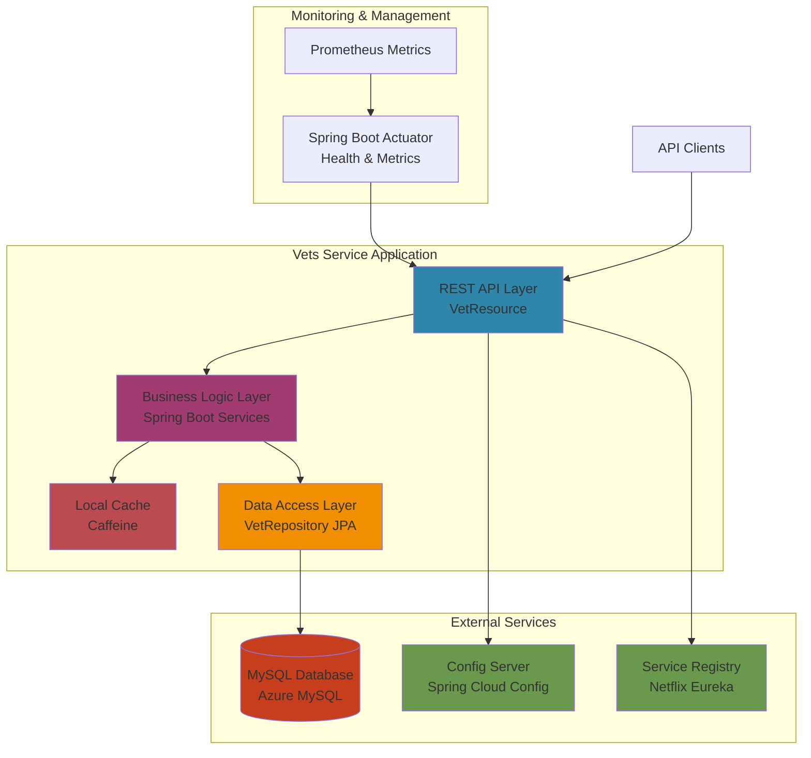

# Vets Service Architecture Diagram

This diagram shows the high-level architecture of the Spring PetClinic Vets Service.

## Application Architecture

## Component Description

### Application Layers

| Layer | Technology | Purpose |
|-------|-----------|---------|
| **REST API** | Spring Web MVC | Exposes veterinarian endpoints (GET /vets) |
| **Business Logic** | Spring Boot | Core business logic and service orchestration |
| **Data Access** | Spring Data JPA | ORM-based data persistence with repositories |
| **Caching** | Caffeine | In-memory caching for vet data |

### Data Storage

| Component | Technology | Purpose |
|-----------|-----------|---------|
| **Primary Database** | MySQL / Azure MySQL | Stores veterinarian and specialty data |
| **Cache** | Caffeine (In-Memory) | Performance optimization for read operations |

### External Dependencies

| Service | Technology | Purpose | Azure Alternative |
|---------|-----------|---------|-------------------|
| **Configuration** | Spring Cloud Config Server | Centralized configuration management | Azure App Configuration |
| **Service Discovery** | Netflix Eureka | Service registration and discovery | Azure Spring Apps Registry |

### Monitoring & Observability

| Component | Technology | Purpose |
|-----------|-----------|---------|
| **Health Checks** | Spring Boot Actuator | Liveness and readiness probes |
| **Metrics** | Micrometer + Prometheus | Performance and business metrics |
| **Distributed Tracing** | Azure Application Insights | Request tracing and diagnostics |

## Technology Stack

- **Framework**: Spring Boot 3.4.1
- **Language**: Java 17
- **Build Tool**: Maven
- **Cloud Platform**: Azure (Spring Cloud Azure dependencies)
- **Database**: MySQL with JDBC
- **Caching**: Caffeine
- **Monitoring**: Actuator, Prometheus, Application Insights

## Architecture Characteristics

### Strengths
- ✅ Stateless microservice design
- ✅ RESTful API with clear endpoints
- ✅ Spring Cloud integration for distributed systems
- ✅ Azure-native JDBC support included
- ✅ Health check and monitoring capabilities
- ✅ Caching for performance optimization

### Migration Considerations
- 🔄 Replace Spring Cloud Config with Azure App Configuration
- 🔄 Use Azure Spring Apps service registry instead of Eureka
- 🔄 Consider Azure Cache for Redis for distributed caching
- 🔄 Configure managed identity for Azure MySQL authentication

## Deployment Target

**Recommended**: Azure Spring Apps (fully managed Spring Boot platform)

**Benefits**:
- Native Spring Cloud support
- Built-in service registry and configuration
- Integrated monitoring with Application Insights
- Simplified deployment and scaling
- Managed infrastructure
