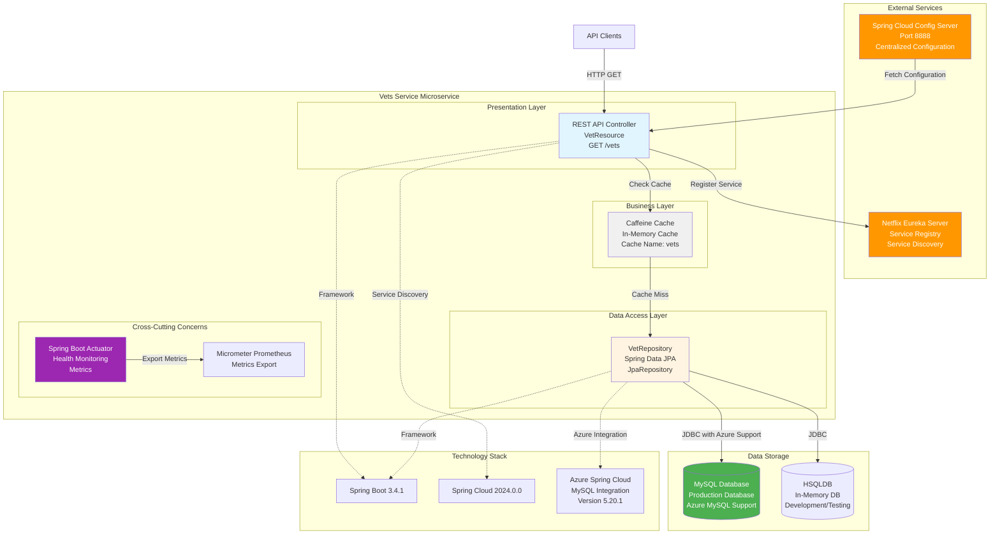

# Architecture Diagram - Vets Service

## Application Overview

**Name**: Spring PetClinic Vets Service  
**Type**: Spring Boot Microservice  
**Version**: 3.4.1  
**Java Version**: 17  

## Architecture Diagram

## Architecture Components

### 1. Presentation Layer
- **REST API Controller** (`VetResource`)
  - Endpoint: `GET /vets`
  - Returns list of veterinarians
  - Uses `@Cacheable` annotation for caching
  - RESTful design with JSON responses

### 2. Business Layer
- **Caching**
  - Technology: Caffeine (in-memory cache)
  - Cache name: `vets`
  - Profile: Production only
  - **Note**: Local cache, not distributed across instances

### 3. Data Access Layer
- **Repository Pattern**
  - Interface: `VetRepository` extends `JpaRepository<Vet, Integer>`
  - ORM: Spring Data JPA
  - Database: MySQL (production), HSQLDB (development/testing)
  - **Azure Integration**: `spring-cloud-azure-starter-jdbc-mysql` for Azure MySQL connectivity

### 4. External Dependencies

#### Service Discovery
- **Netflix Eureka Client**
  - Service registration and discovery
  - Part of Spring Cloud Netflix stack
  - Annotation: `@EnableDiscoveryClient`

#### Configuration Management
- **Spring Cloud Config**
  - Centralized configuration server
  - Default: http://localhost:8888/
  - Docker profile: http://config-server:8888

#### Monitoring & Observability
- **Spring Boot Actuator**: Health checks and application monitoring
- **Micrometer + Prometheus**: Metrics collection and export
- **Jolokia**: JMX-over-HTTP for monitoring

### 5. Technology Stack

| Category | Technology | Version |
|----------|-----------|---------|
| Framework | Spring Boot | 3.4.1 |
| Cloud | Spring Cloud | 2024.0.0 |
| Azure | Spring Cloud Azure | 5.20.1 |
| Java | OpenJDK | 17 |
| Build Tool | Maven | - |
| Database (Prod) | MySQL | Latest |
| Database (Dev) | HSQLDB | Latest |
| Cache | Caffeine | Latest |
| Service Discovery | Netflix Eureka | Latest |
| Configuration | Spring Cloud Config | Latest |

## Data Flow

1. **Request Flow**:
   - Client sends HTTP GET request to `/vets`
   - Controller checks Caffeine cache for cached results
   - If cache miss, repository queries database
   - Results are cached and returned to client

2. **Configuration Flow**:
   - On startup, service connects to Config Server
   - Fetches centralized configuration
   - Applies environment-specific settings

3. **Service Registration**:
   - Service registers with Eureka Server on startup
   - Sends heartbeat to maintain registration
   - Enables service discovery by other microservices

4. **Monitoring Flow**:
   - Actuator exposes health and info endpoints
   - Micrometer collects application metrics
   - Metrics exported to Prometheus format

## Key Observations

### Strengths
- ✅ Modern Spring Boot 3.x with Java 17
- ✅ Azure-ready with spring-cloud-azure-starter-jdbc-mysql
- ✅ Service discovery with Eureka
- ✅ Centralized configuration management
- ✅ Caching for performance optimization
- ✅ Comprehensive monitoring with Actuator and Prometheus

### Areas for Azure Migration Consideration
- ⚠️ **Spring Cloud Config**: Consider migrating to Azure App Configuration
- ⚠️ **Netflix Eureka**: Consider migrating to Azure Spring Apps service registry
- ⚠️ **Local Caffeine Cache**: Consider Azure Cache for Redis for distributed scenarios
- ⚠️ **Service-to-service communication**: May need updates for Azure Spring Apps networking

## Deployment Considerations

- **Containerization**: Docker support configured (port 8081)
- **Database**: Already has Azure MySQL JDBC starter
- **Profiles**: Production and Docker profiles defined
- **Build**: Maven-based build with Spring Boot Maven Plugin

---

*Generated: 2026-02-11*  
*Assessment Tool: Manual code analysis*  
*Target Platform: Azure Spring Apps / Azure Container Apps / Azure Kubernetes Service*
